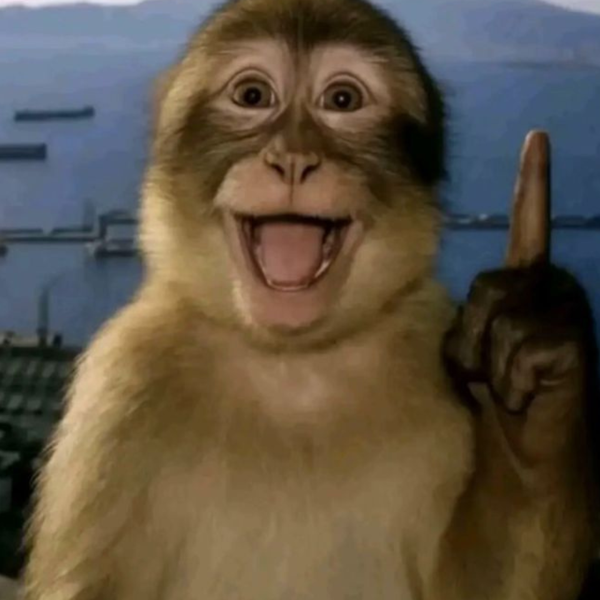
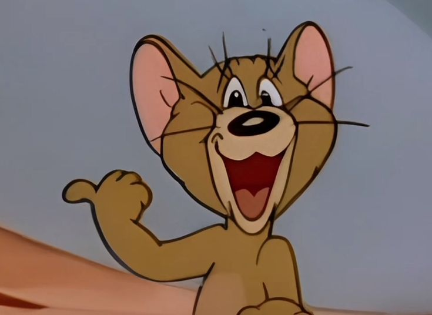
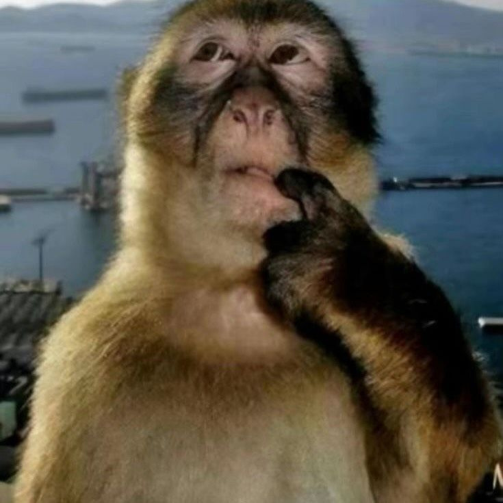

# 🖐️ Gesture & Facial Expression Recognition using OpenCV + MediaPipe

This project detects **hand gestures** and **facial expressions** in real-time using a webcam feed.
It uses **MediaPipe** to track hand and facial landmarks, and then reacts by showing different images depending on the detected gesture or face expression.

---

## 📸 Features

| Gesture / Expression           | Description                                                                    | Trigger Condition                                        | Example Image                         |
| ------------------------------ | ------------------------------------------------------------------------------ | -------------------------------------------------------- | ------------------------------------- |
| **Smart (Pointing Up)**        | Detected when the **index finger is raised** and all other fingers are folded. | Index tip above its PIP joint, others below.             |      |
| **LOL (Thumbs Left)**          | Detected when the **left hand** shows a **thumbs up pointing left**.           | Left hand, thumb extended, other fingers folded.         |     |
| **Surprised (Open Mouth)**     | Detected when **mouth is open** (upper & lower lip distance > threshold).      | Face mesh detects lip gap > 0.01.                        |  |
| **Confused (Finger in Mouth)** | Detected when the **index finger is near the mouth area**.                     | Index fingertip close to mouth center (distance < 30px). |   |
| **None (Default)**             | No gesture or expression detected.                                             | —                                                        | *(Black screen)*                      |

---

## 🧩 Project Structure

```
gesture_recognition/
│
├── main.py                # Main script
├── Smart.png              # Image for "Smart" gesture
├── Smirks.jpg             # Image for "LOL" gesture
├── Surprised.png          # Image for "Surprised" expression
├── Confused.png           # Image for "Confused" gesture
└── README.md              # This file
```

---

## ⚙️ Requirements

Install dependencies:

```bash
pip install opencv-python mediapipe numpy
```

---

## 🚀 How to Run

1. **Connect your webcam**
2. Place the images (`Smart.png`, `Smirks.jpg`, `Surprised.png`, `Confused.png`) in the same directory as the script
3. Run:

   ```bash
   python main.py
   ```
4. The window will show:

   * **Left side:** live camera feed
   * **Right side:** reaction image
5. Press **`q`** to quit.

---

## 🧠 Detection Logic

* **MediaPipe Hands** detects landmarks: wrist, thumb, index finger, etc.
* **MediaPipe FaceMesh** detects lips and mouth position.
* Custom rules determine which gesture or expression is active.
* Matching image is displayed in real-time beside the camera feed.

---

## 🪄 Tips & Tricks

* If detection is inconsistent, lower confidence:

  ```python
  min_detection_confidence=0.5
  ```
* Adjust mouth-open threshold:

  ```python
  if distance > 0.01:
  ```

  → Increase to `0.015` to reduce false triggers.
* Add more gestures by modifying:

  ```python
  # GESTURE LOGIC section
  ```

---

## 👀 Preview of Reaction Images

|               Smart               |                 LOL                |               Surprised               |               Confused               |
| :-------------------------------: | :--------------------------------: | :-----------------------------------: | :----------------------------------: |
|  |  |  |  |

---

## 🧍 Gesture Visual Guide (for users)

| Gesture                 | Visual               |
| ----------------------- | -------------------- |
| **Smart (Pointing Up)** | ✋☝️ Index finger up  |
| **LOL (Thumbs Left)**   | 👍👈 Left thumb out  |
| **Surprised**           | 😮 Mouth open        |
| **Confused**            | 🤔 Finger near mouth |
| **Default**             | 😐 No gesture        |

---

## 📚 Credits

* [MediaPipe by Google](https://github.com/google/mediapipe)
* [OpenCV](https://opencv.org/)

---

## 🧠 Bonus: Ideas for Expansion

Here are some creative ideas you can add later:

* 🎮 Control PowerPoint or music with gestures
* 🤖 Add voice feedback ("Smart mode activated!")
* 🔍 Integrate with YOLOv8 for hybrid hand + object detection
* 🌙 Add low-light filter for better night recognition

